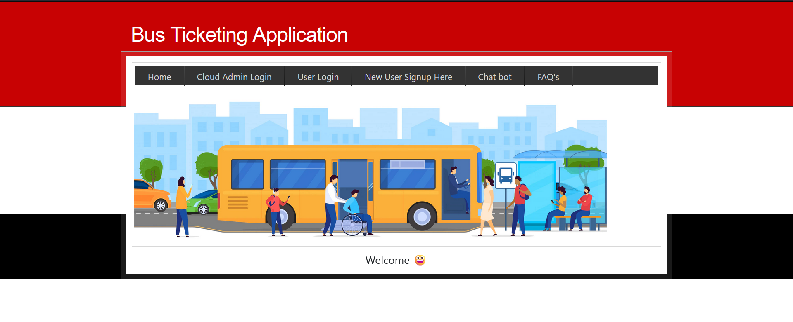
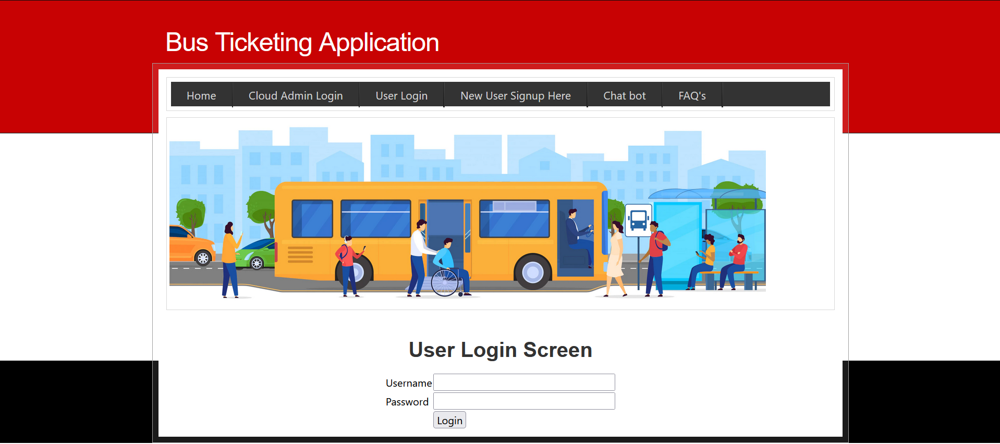
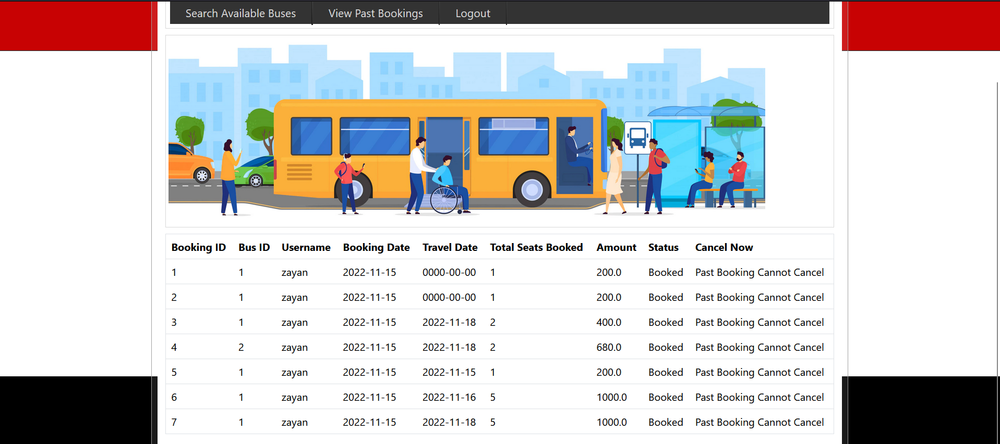
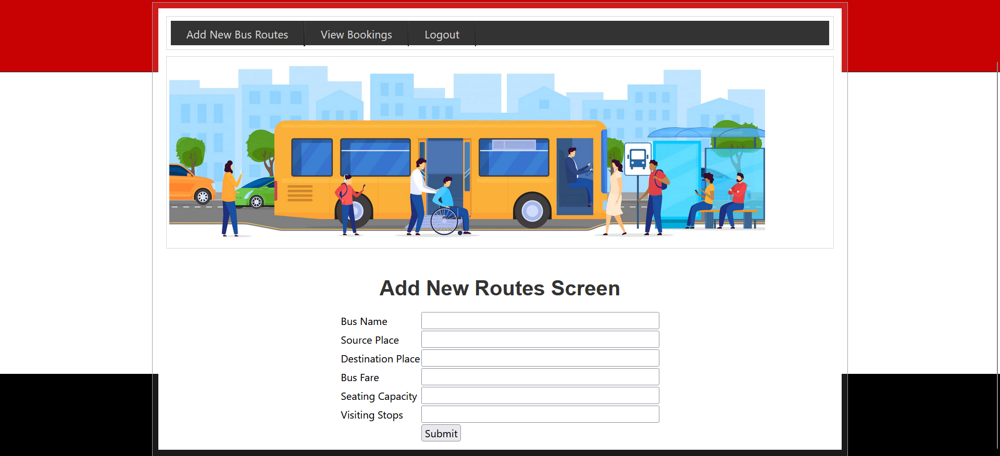

# Bus-ticketing
* This Application to built for online bus ticketing.

## Technologies used
  
* [Django-4.2.6](https://www.djangoproject.com/download/) Django framework is used to build the entire application and all the business logic is written in Python
* [PyMySQL-1.1.0](https://pypi.org/project/pymysql/)  PyMySQL allows Python applications to establish connections to MySQL databases. It provides a simple and efficient way to connect to remote or local MySQL database servers.
* [HTML5](https://html.com/html5/) HTML used to create the User Interfaces (UI)
* [CSS](https://developer.mozilla.org/en-US/docs/Web/CSS) is a stylesheet language used to describe the presentation of a document written in HTML or XML (including XML dialects such as SVG, MathML or XHTML). CSS describes how elements should be rendered on screen, on paper, in speech, or on other media.

## Setup

* Create a folder using command "mkdir" and navigate into the directory
* Now create a virtual environment with command "python -m venv myenv" and activate it using "myenv\Scripts\activate"
* Now install the Django and any required dependencies and add BusBookingApp to the root folder of Django
* Navigate into the BusBookingApp folder and finally run the command "py manage.py runserver" to start the server
* Navigate to localhost:8000/ to find your application homepage

## Screenshots

* Home View

.
-----

* User login

.

-----
* User Bookings

.

-----
* Admin login

.

-----
* Admin Adding new routes

.
